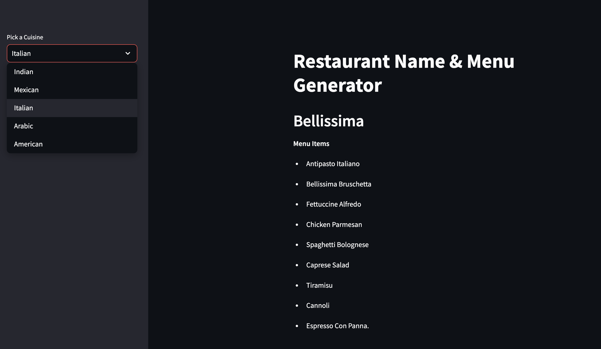

# 🧠 AI-Powered Restaurant Name & Menu Generator

This application generates creative **restaurant names** and **menu items** based on a selected cuisine using **Generative AI**. Whether you're a food entrepreneur, designer, or just curious, this tool is designed to spark inspiration and creativity.

---

## 🍽️ Supported Cuisines

Currently, the app supports the following cuisine types:

- 🇮🇳 **Indian**
- 🇲🇽 **Mexican**
- 🇮🇹 **Italian**
- 🇸🇦 **Arabic**
- 🇺🇸 **American**

---

## ⚙️ Tech Stack

| Component        | Technology                                      |
|------------------|--------------------------------------------------|
| **Frontend**     | [Streamlit](https://streamlit.io/)               |
| **LLM (Local)**  | `llama3` via [Ollama](https://ollama.com/)       |
| **Prompt Chain** | [LangChain](https://www.langchain.com/)          |

The app runs entirely **locally**, ensuring privacy and low latency, while leveraging the powerful capabilities of **llama3** for natural language generation.

---

### 🖼️ App Interface


---

## 💡 Features

- 🎯 Generate **restaurant names** themed around the selected cuisine.
- 🍕 Output **menu items** consistent with culinary traditions.
- 🔒 Powered by **locally hosted** LLM (llama3 via Ollama).
- 🔗 Prompt chaining via **LangChain** for modular and extendable logic.
- 🧪 Clean and user-friendly UI using **Streamlit**.

---

## 🚀 Getting Started

### 1️⃣ Install Ollama and Pull the Llama3 Model

Make sure you have [Ollama](https://ollama.com/) installed.

Then pull the `llama3` model locally:

```bash
ollama pull llama3
```

### 2️⃣ Clone the Repository

```bash
git clone https://github.com/your-username/restaurant-menu-generator.git
cd restaurant-menu-generator
```

### 3️⃣ Set Up a Virtual Environment & Install Dependencies

We recommend using a virtual environment:
```bash
python -m venv venv
source venv/bin/activate  # On Windows: venv\Scripts\activate
```

Then install dependencies:
```bash
pip install -r requirements.txt
```

### 4️⃣ Run the App

Launch the Streamlit app:

```bash
streamlit run app.py
```

The app will open in your default web browser. Select a cuisine, and let the AI generate a restaurant concept for you!
